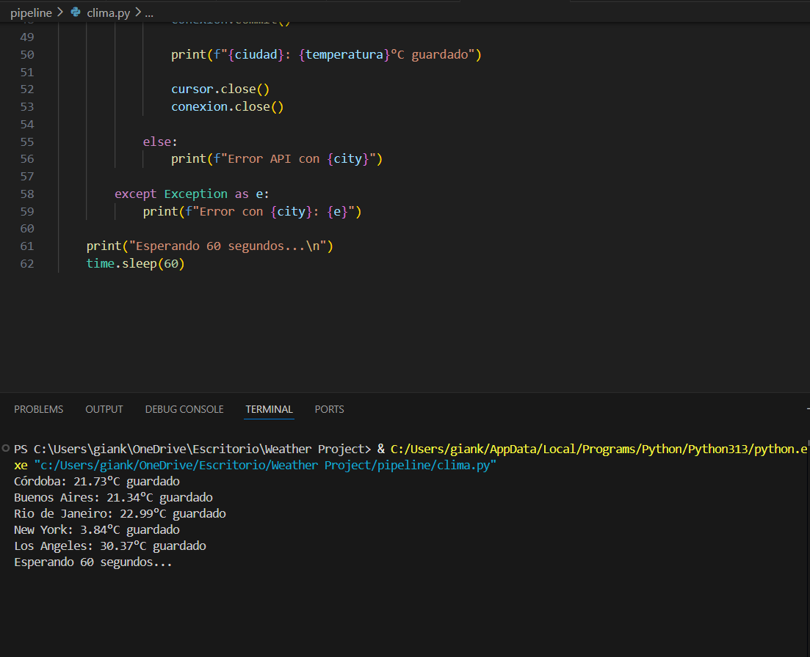
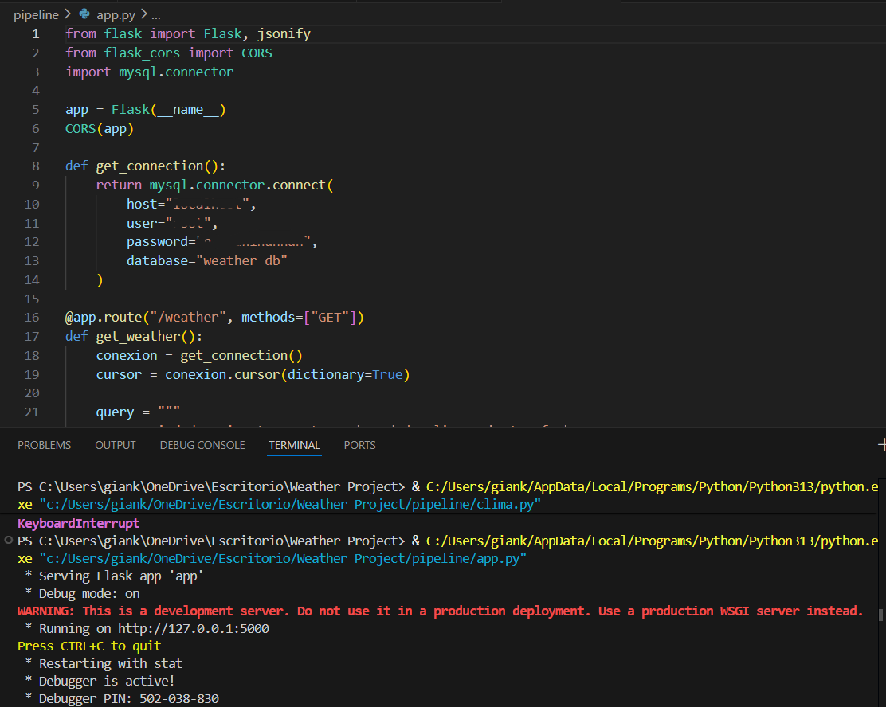
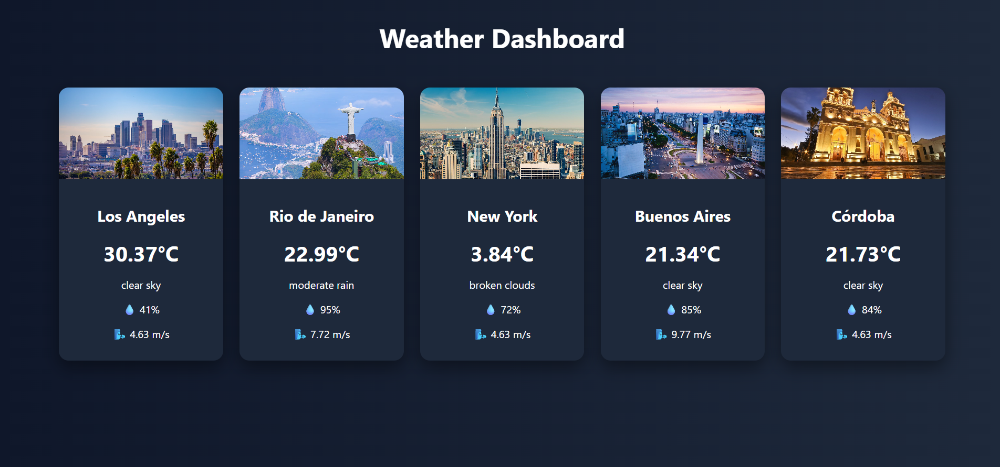

## (versión en español más abajo)

# Real-Time Weather Data Pipeline

## Project Overview
This project demonstrates the design and implementation of a data engineering pipeline that consumes real-time weather data from an external API, processes it using Python, and stores it in a relational database.

**Important: This project is intended for portfolio purposes only. Due to API key restrictions and environment configuration, it may not run directly on another machine. The goal is to showcase the architecture, logic, and data pipeline skills through the code.**

## Objectives
* Consume real-time data from a weather API
* Build an automated data pipeline using Python
* Store structured data in a MySQL database
* Simulate a real-world data engineering workflow

## Tech Stack
* Python → Data extraction & processing
* Requests / JSON → API consumption
* MySQL → Data storage
* SQL → Data modeling & queries
* HTML / CSS / JavaScript → Simple frontend visualization

## Architecture

The project is divided into two main parts:
1. Data Pipeline (/pipeline)
* Connects to the weather API
* Extracts real-time data
* Transforms JSON into structured format
* Inserts data into MySQL

2. Frontend (/frontend)
* Displays weather data
* Uses JavaScript to fetch and render information
* Simple UI for visualization

## Data Flow
1. API request is made to retrieve weather data
2. Data is received in JSON format
3. Python processes and cleans the data
4. Structured data is inserted into MySQL
5. Frontend consumes and displays the data

## Key Learnings
* Building end-to-end data pipelines
* Working with real-time data sources
* API integration and data transformation
* Database design and data insertion
* Connecting backend processes with a frontend

## Limitations
* API key is not included (security reasons)
* Environment variables are not configured
* Pipeline may not run without proper setup

## Future Improvements
* Automate pipeline execution (cron / scheduler)
* Deploy database to cloud (AWS / GCP)
* Add data visualization dashboards (Power BI / Tableau)
* Implement error handling and logging

## Author

Gian Sena

# ESPAÑOL

# Pipeline de Datos Climáticos en Tiempo Real

## Descripción del Proyecto
Este proyecto demuestra el diseño e implementación de un pipeline de ingeniería de datos que consume datos meteorológicos en tiempo real desde una API externa, los procesa utilizando Python y los almacena en una base de datos relacional.

**Importante: Este proyecto está destinado únicamente a fines de portfolio. Debido a restricciones de la API y configuración del entorno, puede que no funcione directamente en otra máquina. El objetivo es mostrar la arquitectura, la lógica y las habilidades en pipelines de datos a través del código.**

## Objetivos
* Consumir datos en tiempo real desde una API meteorológica
* Construir un pipeline de datos automatizado usando Python
* Almacenar datos estructurados en una base de datos MySQL
* Simular un flujo de trabajo real de ingeniería de datos

## Tecnologías Utilizadas
* Python → Extracción y procesamiento de datos
* Requests / JSON → Consumo de la API
* MySQL → Almacenamiento de datos
* SQL → Modelado de datos y consultas
* HTML / CSS / JavaScript → Visualización simple en frontend

## Arquitectura
El proyecto está dividido en dos partes principales:
* Pipeline de Datos (/pipeline)
* Se conecta a la API meteorológica
* Extrae datos en tiempo real
* Transforma JSON en formato estructurado
* Inserta los datos en MySQL

## Frontend (/frontend)
* Muestra los datos del clima
* Utiliza JavaScript para obtener y renderizar la información
* Interfaz simple para visualización

## Flujo de Datos
* Se realiza una solicitud a la API para obtener datos del clima
* Los datos se reciben en formato JSON
* Python procesa y limpia los datos
* Los datos estructurados se insertan en MySQL
* El frontend consume y muestra los datos

## Aprendizajes Clave
* Construcción de pipelines de datos de extremo a extremo
* Trabajo con fuentes de datos en tiempo real
* Integración de APIs y transformación de datos
* Diseño de bases de datos e inserción de datos
* Conexión entre procesos backend y frontend

## Limitaciones
* La API key no está incluida (por razones de seguridad)
* Las variables de entorno no están configuradas
* El pipeline puede no funcionar sin la configuración adecuada

## Mejoras Futuras
* Automatizar la ejecución del pipeline (cron / scheduler)
* Desplegar la base de datos en la nube (AWS / GCP)
* Agregar dashboards de visualización de datos (Power BI / Tableau)
* Implementar manejo de errores y logging

## Autor
Gian Sena